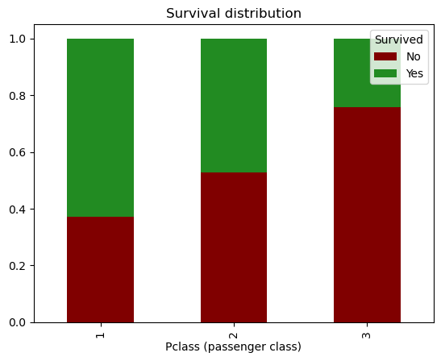

# Introduction
Active Learning is a strategy employed in training machine learning algorithms on insufficient data. Data can be insufficient for several reasons including the cost of acquiring it, or the cost of correctly labelling the data. Active learning is an iterative process of training the alogithm, using human intervention at the end of iteration to optimize the learning process. The data is fed to the algorithm in batches. At the end of each training batch, the algorithm selects the most interesting data points, and queries the human agent (teacher or oracle) to correctly label that data. This data is now fed with the next batch back into the algorithm for re-training. This cycle continues until the model achieves acceptable accuracy.

I conducted this experiment on the dataset, provided by Kaggle for the popular ML Challenge on the Survival of the Titanic. As we all know, on April 15, 1912 during her maiden voyage, the "unsinkable" RMS Titanic sank 1 hour after colliding wiht an iceberge. It is one of the most infamous maritime disasters in history, and has inspired several cultural references including the Award-winning James Cameron movie of the same name. 1502 out of 2224 passengers died in the sinking. Some people were more likely to survive than others. The Kaggle challenge is to develop an algorithm that can predict survival rates. It is an interesting challenge and highly recommended to first-time data science and machine learning students.

This experiment starts by building a training pipeline for a Support Vector Classifier which will be trained with the conventional 'passive' learning method of fitting on the entire dataset. This will then be the baseline model that will be used to evaluate the performance of the Active Learning strategy. 


# EDA and Feature Engineering
There are many interesting ways to explore this data and consequently develop informative Features. However the scope of the Exploratory Data Analysis – cleaning, handling missing values, statistical analysis – is beyond this article. For the purpose of this analysis of Active Learning, I kept the strategy simple. 

Here's a screen capture of the dataset before... 


...and after feature engineering.


In summary, the changes I made were:
- Dropped columns for `Tickets`, `Fare` and `PassengerId`
- Converted the `Cabin` field to a binary parameter `CabinInfo` that simply lists if that information is available.  
- Replaced `SibSp` and `Parch` which are all indications of travelling with family/companions with a single feature `With_Family`.
- Filled missing information on `Embarked` and `Ages` with aggregations over `Sex` and `Pclass` (Passenger class)




(Statistical confirmation that the parameters of `Sex` and `Pclass` (passenger class) strongly impact the target `Survived`. Not a surprise, especially if you've watched the movie.)


# Baseline Model and Results


Custom classes `CustomImputer` and `ColumnGenerator` were created to deal with the missing values and to generate the new feature columns described above. 


It should be noted here that there was a class imbalance, a common problem with classification modelling, which had to be dealt with as part of the process. 


These are good results, considering that the model was instantiated on default parameters and with no rigorous hyper-parameter tuning.

# Active Learning
As said in the introduction, the purpose of Active Learning is to compensate for insufficient data. The training process is iterative, with the algorithm first seeing a small sample of the available dataset, which increases with each iteration. A human agent intervenes at the end of an iteration to correctly label the data that gives the most interesting information to the algorithm.

![plot-active learning cycle]

This can also be described mathematically. The total set of data under consideration is T.
At the start of the process, $T$ is broken into 2 subsets: 

1. $T_K,_1$ - a fraction of $T$, data with **known** labels that is used to train the algorithm. In active learning terminology, this is the *seed*.

2. $T_U,_1$ - reserved data for testing whose labels are **unknown** to the algorithm.

At the end of each training cycle, the model scores the test data, and a human agent examines its results. The human agent chooses the most interesting results to label. This subset of **chosen** data is $T_C,_1$. This and a new set of labelled data $T_K,_2$ is fed back into the algorithm. Mathematically, in the next cycle, $i=i+1$:

$$T_K,_{i+1} = T_K,_i + T_C,_i$$
$$T_U,_{i+1} = T_U,_i - T_C,_i$$

This process repeats until the algorithm achieves the desired accuracy. Or until $T_U,_i = 0 $ i.e. there are no more new data points available for training. 

The obvious question is how do we choose what data to be labelled? This is known as query selection, and there are specific strategies to use depending on the scenario. For this experiment, I used the strategy of **Least Confidence**, which because this is a binary classification problem, also becomes a **Margin Sampling** strategy.

To describe these strategies, it would be easier to go through the code itself.

### Step 1: Extract the initial seed $T_K,_1$, from the training data

```python
# train_df is the set of the entire dataset available for training
# this is the first seed, the labelled data for training, Tk
start_df = train_df.sample(n=100, random_state=394) 

# this is what remains, Tu
df = train_df[~train_df.PassengerId.isin(start_df.PassengerId.tolist())] 

# use class balancing function to generate X_train, y_train
X_train, y_train = class_balancing(train_df, 'Survived');
```

It's worth noting here that some of the features generated depended on the entire training dataset being available before fitting. Therefore this will affect the performance of the model and part of the experiment is observing if the model can quickly adjust to this deficiency. 

### Step 2: Train the model on the seed 
Most of the code is functionized and the reason for this will become apparent soon. The full notebook with the code will be made available on my github. 
```python

model_1 = model_generator(start_df) 
# model_generator is the function that returns the new instance of an SVC pipeline model

score = scoring_test_df(model_1, X_train, y_train)
# scoring_test fits the model on X_train and y_train and returns the training scores
```

### Step 3: Choose the most informative subset, $T_C,_1$, from $T_K,_1$ to query

This is the process of query selection, and this experiment uses the `Method of Least Confidence`. This involves examining the prediction scores of the data points, and selecting those which the algorithm is *least confident* of its prediction. As this is a binary classification, that would simply be test scores that are 0.5 or close to 0.5. 
```python
scored_results = scoring_df(model_1, df)
# scored results tests the model on X_test and y_test (the holdout batch)
# it returns a table of the top 10 results, sorted according to Least Confidence
scored_results
```


*Margin sampling*, on the other hand, selects the results which have the smallest difference between the prediction scores of the first and second probable labels. In a binary classification problem, this just reduces to *least confidence* as there are only 2 possible labels.

### Step 4: Increment the original seed data
In addition to the original seed: $T_K,_2$, new labelled data from the dataset and the query i.e the datapoints chosen in the previous set, $T_C,_2$ are added into the training data. 

```python

def training_generator(start_df, scored_results, train_df=train_df):

    # updating the training index
    training_index = np.concatenate((start_df.index, scored_results.index))

    model_df = train_df.loc[training_index]
    X_train, y_train = class_balancing(model_df, 'Survived');

    # left over df
    df = train_df[~train_df.PassengerId.isin(model_df.PassengerId.tolist())]

    ## Remember train_df is thh entire dataset outside the test_df. 
    ## Start_df and df add up to train_df. With each iteration, df gets smaller and start_df gets larger

    return model_df, X_train, y_train, df
model_2, X_train_2, y_train_2, df = training_generator(start_df, scored_results, train_df=train_df)

```

### Step 5: Repeat Steps 2 - 4 .
The model is trained on the new seed. After training, the test scores are examined and the training data is adjusted as described in *(4)*. The process becomes a cyclic feedback loop. It will continue until either the entire dataset has been fitted on the model (i.e. $T_U,_{i}=0$) or we've achieved our target accuracy.

```python
# initialization
start_df = train_df.sample(n=400, random_state=394)
X_train, y_train = class_balancing(start_df, 'Survived')
# left over df
df = train_df[~train_df.PassengerId.isin(start_df.PassengerId.tolist())]

num_iterations = 70
scores = [] # accuracy, precision, recall
models = []

# active learning loop
for i in range(num_iterations):
    if i == 0:
        model_df = start_df  
    model = model_generator(model_df)
    models.append(model)
    score = scoring_test_df(model, X_train, y_train)
    scores.append(score) # accuracy, precision, recall
    scored_results = scoring_df(model, df)
    model_df, X_train, y_train, df = training_generator(model_df, scored_results, train_df=train_df)
    print(f"Iteration # {i}, scored {score}")

```

## Evaluating Performance 
These are the score metrics of the process per iteration of the loop.


The results flunctuated a bit the jumped up at the 46th mark, which approximates i.e. when the training_set was 560. Compare this to the original "Passive Training" that required a dataset of 791 records.

# Conclusion

Active Learning is definitely an advantage when the source data is "expensive". Even the human "cost" i.e. manually labelling the data can be mitigated to some extent with automation, as we observed with this experiment.

However, its advantage is strictly in situations where data is hard-to-source. Not having a large dataset restricts opportunities in feature engineering, which can in turn affect the efficiency of the model.

The strategy of iteratively improving a model with more data is also applied in *Online Learning*. 